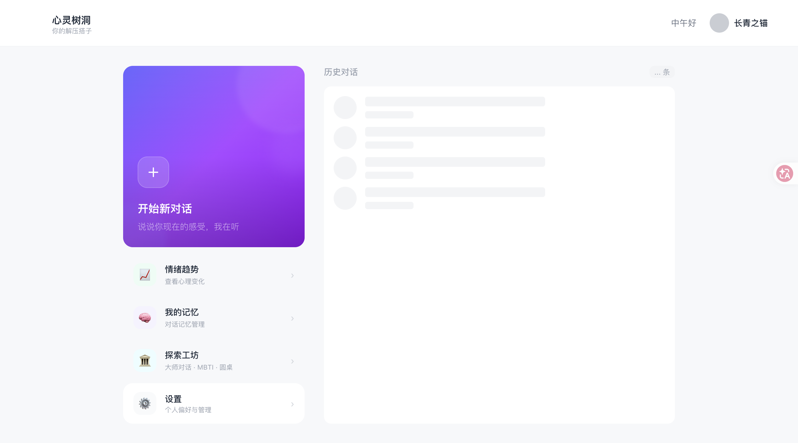

# Mental Health Agent

Mental Health Agent is a safety-aware AI companion for workplace stress. It provides conversational support, structured coping exercises, optional assessments, and multiple model providers while keeping safety routing visible in the product design.

## Product scope

- Conversational support with a lightweight, non-clinical tone.
- Breathing, mindfulness, cognitive reframing, and other structured exercises.
- Scenario recognition and safety-aware routing before deeper conversation flows.
- Optional PHQ-9 and GAD-7 collection presented as guided assessments.
- Mentor, MBTI, and round-table exploration experiences.
- Provider adapters for DeepSeek, OpenAI, Kimi, OpenRouter, and GLM.
- Academic evaluation datasets, unit tests, smoke checks, and provider baselines.

This project is not a substitute for professional care. Emergency or crisis situations should be handled by local professional services.

## Architecture

~~~text
Next.js UI
   |
Conversation route -> triage and safety gates -> counselor / skill / assessment flow
   |                                      |
Prisma + PostgreSQL                    provider adapters
   |
Evaluation datasets and deterministic checks
~~~

## Quick start

Prerequisites: Bun, Node.js, and a PostgreSQL-compatible database.

~~~bash
bun install
cp env.example .env.local
bun prisma generate
bun prisma migrate deploy
bun dev
~~~

Open http://localhost:3002. Configure only the providers you intend to use and keep .env.local private.

## Testing

~~~bash
bun run typecheck
bun run test:unit
bun run smoke
bun run ci:check
~~~

ci:check combines configuration verification, type checking, focused safety tests, unit tests, and the application smoke path. Provider-specific smoke checks require their corresponding credentials.

## Documentation

- Architecture: ARCHITECTURE.md
- Project summary: PROJECT_SUMMARY.md
- Build and deployment rules: PROJECT_CONSTITUTION.md
- Design guide: DESIGN_GUIDE.md
- Operational docs: docs/

## Releases

Push a semantic version tag such as v0.3.0. The release workflow creates a GitHub Release with generated notes. Deployment is a separate credentialed step.

## Roadmap

- Keep safety routing and provider behavior deterministic and inspectable.
- Improve newcomer setup and local demo data.
- Expand evaluation coverage for scenario recognition and exercise selection.
- Document production deployment and crisis-response review steps.

## License

MIT is the current project license declaration in the repository documentation. A dedicated license file should be added before distributing the project as open source.
